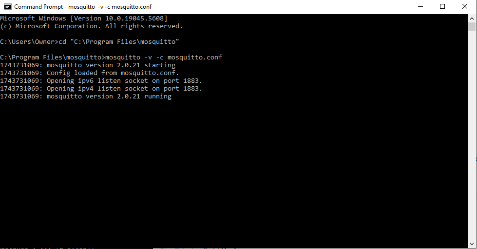
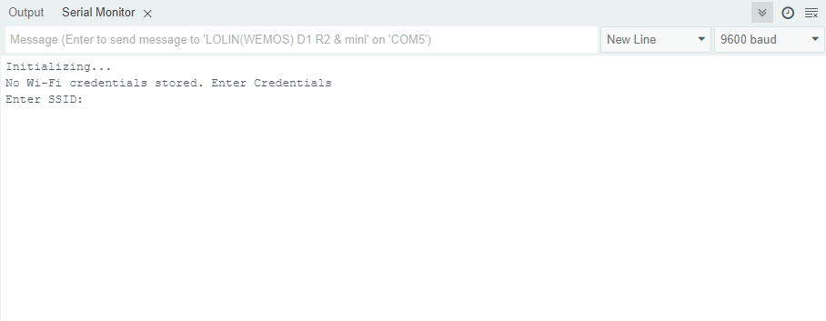

# Wifi Garage Stoplight - Arduino User Support

This documentation is intended for the end user of the Wifi Garage Stoplight devices.
The system is a wifi stoplight built to help find the optimal parking distance within your garage.  It utilizes a distance sensor to light up an indicator LED based on how close you are to the wall of your garage.  It operates through a series of sent from multiple devices.

### Description ###
The Wifi Garage Stoplight system consists of four separate devices:
1. The LED Device, which lights up LEDs based on the distance your vehicle is to the garage wall.
2. The Sensor Device, which measures the distance from the garage wall to your vehicle and sends this information to the LED device.
3. The Door Device, which checks whether or not the garage door is open. If the garage door is closed, it sends a signal to the LED device to shut down to conserve power.
4. The Broker Device, which manages the messages between the other three devices.  Instructions for setting up your broker device are included in this documentation.

### Setting up the Device ###

To begin using the system, you will need to download the latest [Eclipse Mosquitto MQTT Broker](https://mosquitto.org/) onto the device you designated as your Broker Device as well as the arduino IDE.  This can be a laptop, a desktop device, a Raspberry Pi, etc.  This device will need to be active at all times in order for the system to operate.  

Once you have Mosquitto installed on your designated device, you will need to set up security for the devices.  Follow these instructions.
1. Navigate to the install directory (by default, C:\Program Files\mosquitto) via cmd.
2. Run the command `mosquitto_passwd -c "C:\Program Files\mosquitto\passwords" mqtt_dsensor`.  Enter the password included in the packaging that corrseponds to the mqtt_dsensor identifier.  Confirm the password
3. Run the command `mosquitto_passwd -c "C:\Program Files\mosquitto\passwords" mqtt_led`.  Enter the password included in the packaging that corrseponds to the mqtt_led identifier.  Confirm the password
4. Run the command `mosquitto_passwd -c "C:\Program Files\mosquitto\passwords" mqtt_reed`.  Enter the password included in the packaging that corrseponds to the mqtt_reed identifier.  Confirm the password
5. Run the command `mosquitto_passwd -c "C:\Program Files\mosquitto\passwords" mqtt_user`.  Enter a password of your choice, this will be the user you use when you need to reset certain settings on the devices.  Confirm the password
6. Open the mosquitto.conf file with administrator privileges
7. Add the following lines to the end of the document
`password_file C:\Program Files\mosquitto\passwords`
`listener 1883`

Once security is set up, you must initialize the broker.
1. Navigate to the install mosquito install directory and run the following command: `mosquitto -v -c mosquitto.conf`
2. Verify that that mosquitto has started correctly, see the screenshot below:

Once you have the broker set up, you can begin operating the system. Please ensure that:
1. All devices are plugged into a power source.
2. All devices are connected to the same wifi network.

The blue indicator LED on each device will exhibit the following behavior based on your connectivity
1. OFF - If the device is not powered
2. BLINKING - If the device is on but not fully connected to the WiFi or the Broker device
3. SOLID - If the device is on and fully connected

You will need to connect your devices to the internet as part of the initial set up.  To do this...
1. With the broker running, open the Arduino IDE
2. In the option bar, find and select `tools > Serial Monitor`
3. Plug the Sensor device into your computer.  You will be prompted to enter your Wifi network (SSID) and the network password

4. Once set up, the settings will be stored in memory.  Repeat step 3 for the Door device and the LED device.

If you need to clear or change the WiFi settings, see the `System Operation` section for information on how to do this.

### System Operation ###
Once all devices are connected to the internet, mount the sensor device to the wall of your garage, side opposite the garage door.  Place the LED device somewhere you can see it.  Finally, set up the Door device.  The main device should be attatched to the bottom of the garage, adjacent to the garage door. The trigger should be mounted to the door itself such that when the garage door is closed, it is adjacent to the main Door device.

Once set up, the LED device will indicate your proximity to the garage wall in the following ways:

1. OFF - If your garage door is closed, to conserve power.
2. GREEN - If your vehicle is within 60 or more centimeters from your wall.
3. YELLOW - If your vehicle is within 40-60 centimeters from your wall.
4. RED - If your vehicle is within 20-40 centimeters from your wall.
5. BLINKING RED - If your vehicle is within 20 centimeters from your wall, the red light will blink.

If you wish to reset the Wifi on any of the device, follow the steps below:
1. Plug the desired device into the broker device and open the arduino IDE
2. Open a command prompt and navigate to the mosquitto install directory.
3. Type the following command: `mosquitto_pub -h <BROKER_IP> -t device/reset -m <DEVICE> -u mqtt_user -P <PASSWORD>`, replacing `<BROKER_IP>` with the IPv4 address of the broker device and `<DEVICE>` with "sensor" for the Sensor device, "led" for the LED device and "reed" for the Door device.  Additionally, replace `<PASSWORD>` with the password you specified for the user in step 5 of the initial set up.
4. The device will reset, and you will be prompted for new WIFI credentials

### Support ###
If you encounter any issues, please reach out to Operations Support for guidance.  Thank you for using this system.