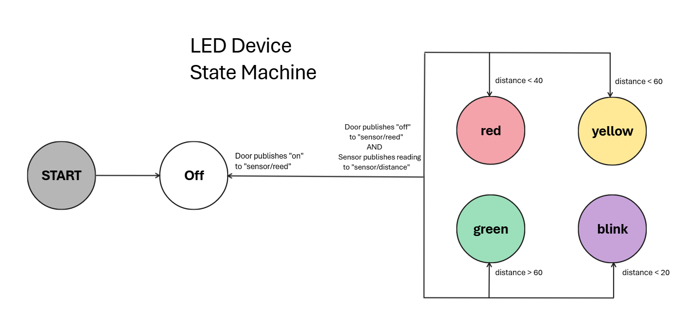

# Wifi Stoplight - Arduino Engineer Support

This documentation is intended for the support engineer to assist enhancing and troubleshooting the Wifi Stoplight.
The system is a wifi stoplight built to help find the optimal parking distance within your garage.  It utilizes a distance sensor to light up an indiciator LED based on how close you are to the wall of your garage.  It operates through a series of requests received through either the API calls or manually through HTTPs.

## Getting Started ##

Reach out to the previous engineer to receive access rights to the github repository https://github.com/irvinmdoza/wifi_distancesensor/tree/main

Once you have access, you can download the repository and make modifications where/if necessary.  Currently all editing is done through the Arduino IDE, with the Wemos D1 mini libraries added.

## System Operation ##

The system will automatically start as long as the devices are powered.  In order to monitor the status of either device, it must be connected to a device running the Arduino IDE.  The device will send status messages to the Serial Monitor for monitoring and troubleshooting.

## Directory Structure ##

The following describes the directory structure with notes on important locations

1. /code: Contains the code for the application, specifically the wifi_light.ino and wifi_distancesensor.ino files.  These files host the stoplight functionality and the distance sensor functionality respectively.

2. /docs: Contains the documentation for the application, including this guide, end user and operations center guides as well as the primary design document.

3. /img: Contains images referenced in the documentation.

4. README.md: File that contains a general directory for the project.

## Assembly and Configuration ##
This device has the following technical specifications
1. The devices hosting the applications are two Wemos D1 Mini
2. The stoplight device, referred to as the indicator device, receives http requests from the sensor device based on the distance sensed by it.  The specific distance must be configured by an engineer, at the time of writing.
3. The distance sensor device, referred to simply as the sensor device, receives signals from its attached sensor and sends requests to the indicator device based on the distance read.

The device assembly consists of
- 2 Wemos D1 Mini
- 1 HC-SR04 Ultrasonic Sensor
- 12 Jumper Wires
- 3 LEDs, one of each of the following colors: Red, Green, Yellow
- 3 75 Ohm resistors

They are connected as shown in the following schematics:

## State Machine

The following state machines describe the behavior of the devices.
The indicator changes state based on the HTTP request it receives.
The sensor sends HTTP requests to the indicator based on the distance it reads.

### Troubleshooting Issues ###

The following are troubleshooting steps for issues that the Operations Support center might reach out about.

#### Device Wifi ####

Support might contact you trying to verify the Wifi the device is connected to.  Inspect the code to see what the Wifi the device is connecting to is.

#### The Host is Unavailable ####

If the host is unavailable, verify that the devices are powered.  If they are powered, verify that the blue LED on the devices are on and not blinking.  If they are not, this indicates that the devices are not connected to the Wifi network.  Verify that the network defined in the code is accurate as well as the credentials.  

If the credentials need to be updated, make the changes to either the wifi_light.ino file or the wifi_distancesensor.ino file depending on which of them was failing and then upload the updates to the devices.